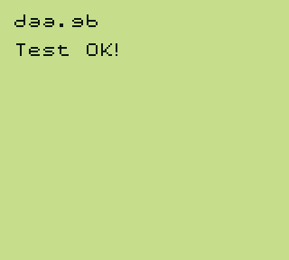
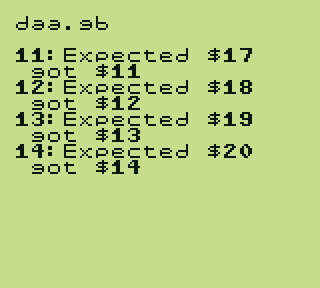

# CPU / Instructions

## Table of Contents

- [daa](#daa)

## daa

The daa test checks if the DAA instruction calculates the resulting values correctly by looping through $00 - $FF, calling the DAA instruction on every value and comparing the results to a pre-calculated table.

If all values match with the comparison table, "Test OK!" should be output. If there are any mismatches, text in the following format is displayed: `[a_value]: Expected $[expected_value] got $[tested_value]`, where `a_value` is the value which DAA was executed on, `tested_value` was the value which resulted from the DAA instruction and `expected_value` is the value which it was compared against.

The test can also be run without a PPU implementation due to a blargg-like "debug output" system. ASCII bytes are written to the SB register (`$FF01`) and can be output on the console. Initially, the ROM also waits for the LY register to reach the VBlank section, however, this does not need to be implemented either, as it times out if VBlank isn't detected in time.

### Requirements:

- Basic CPU Functionality (including `SWAP` and `ADC`)

### Verified on:

- ✔ Gameboy Pocket (MGB 9638 D)
- ✔ Gameboy Color (CPU CGB D)

### Screenshots:

#### Test Passed

#### Test Failed

