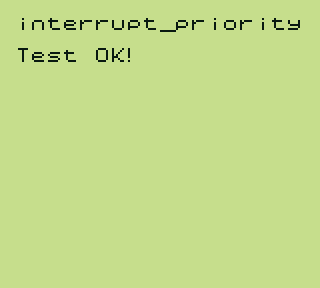
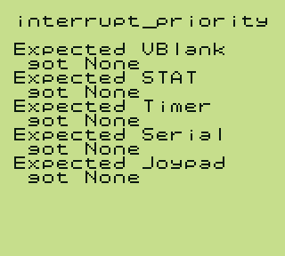

# Interrupts

## Table of Contents

- [interrupt_priority](#interrupt-priority)

## interrupt_priority

The interrupt_priority test checks the order in which interrupts are serviced by initially writing $FF to both IE and IF registers, then writing the order in which the interrupts are serviced to RAM. Afterwards, the order is checked and errors, if any, are output. If there are no errors, the text "Test OK!" appears.

The RAM section `$C000 - $C004` is initialized with the value `$68`, which is not a valid interrupt vector and is interpreted by the ROM as "None". When interrupts are fired, the interrupt handlers should write their vector addresses into RAM in the order in which they are called, meaning that the RAM section `$C000 - $C004` should contain the values `$40, $48, $50, $58, $60` at the end of the test.

The test can also be run without a PPU implementation due to a blargg-like "debug output" system. ASCII bytes are written to the SB register (`$FF01`) and can be output on the console. Initially, the ROM also waits for the LY register to reach the VBlank section, however, this does not need to be implemented either, as it times out if VBlank isn't detected in time.

### Verified on:

- ✔ Gameboy Pocket (MGB 9638 D)
- ✔ Gameboy Color (CPU CGB D)

### Screenshots:

#### Test Passed

#### Test Failed

