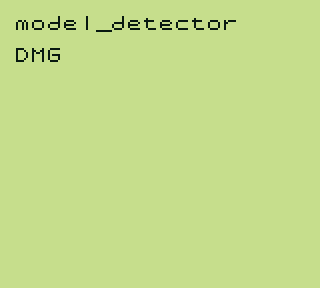
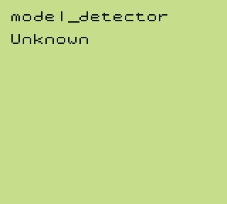

# Other

## Table of Contents

- [model_detector](#model_detector)

## model_detector

The model_detector test executes a thorough check on initial register states in order to determine the Gameboy model the ROM is running on. The initial values of all registers are tested, rather than only the ones that differ between models, in order to guarantee 100% accuracy.

After running the test, an "identifier" value will be written to `$C000`, which is then used to determine the string to display as the detected model, based on the following table:

```
$00 : Unknown
$01 : DMG
$02 : MGB (currently also SGB2)
$03 : SGB
$04 : SGB2 (currently unused)
$05 : CGB
$06 : AGB/AGS
```

The test can also be run without a PPU implementation due to a blargg-like "debug output" system. ASCII bytes are written to the SB register (`$FF01`) and can be output on the console. Initially, the ROM also waits for the LY register to reach the VBlank section, however, this does not need to be implemented either, as it times out if VBlank isn't detected in time.

**Disclaimer:** The data tested against is based on [The Cycle-Accurate Game Boy Docs](https://github.com/AntonioND/giibiiadvance/blob/master/docs/TCAGBD.pdf).

### Requirements:

- Basic CPU Functionality (including `SWAP` and `ADC`)

### Verified on:

- ✔ Gameboy Pocket (MGB 9638 D)
- ✔ Gameboy Color (CPU CGB D)

### Screenshots:

#### Test Passed (DMG)



#### Test Failed



